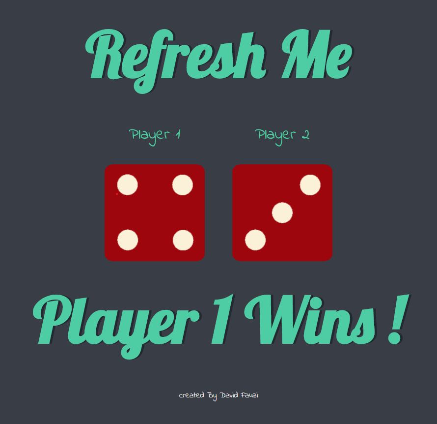

# dice-game
Simple static website dice game to determine winner between 2 people by throwing dice with random probability. Using Javascript ES6 DOM and simple HTML&amp;CSS design. 
## How to Play

 
1.View the Page .  
2.if player 1 have a higher dice number, he wins and vice versa.  
3.Refresh the page to randomize dice number again. 
